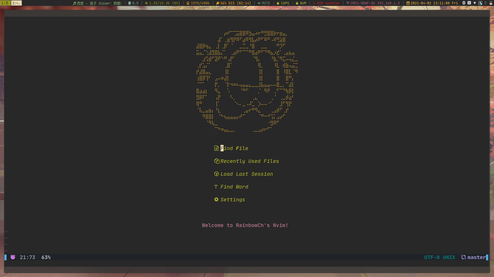
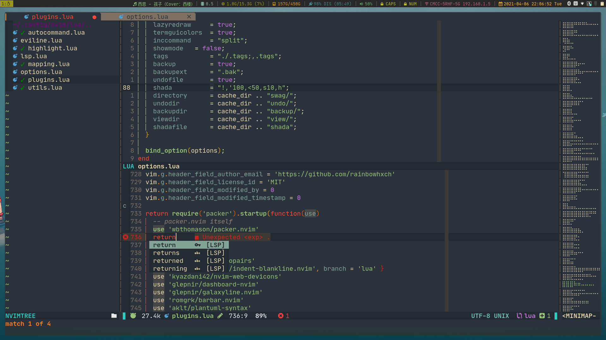

    <h1>🌈Rainbow Nvim🌈</h1>

# Feature
- 🐮 Two choice: `VimL` or `Lua`
- ⚖️  Support multi language building, running and testing (using [asynctasks.vim](https://github.com/skywind3000/asynctasks.vim))
- 🚁 Float Terminal (using [vim-floaterm](https://github.com/voldikss/vim-floaterm)) and some cool stuff based it
- ⛄ Support snippets (using [vim-vsnip](https://github.com/hrsh7th/vim-vsnip))
- 🌋 Debug (using [nvim-dap](https://github.com/mfussenegger/nvim-dap))
- 🎹 Two keyboard lawyer in **Insert Mode**: `qwerty` and `colemak`
- 📢 `coc` or `built-in` LSP
- 🚠 Many other useful stuff, check the [plugins](https://github.com/rainbowhxch/nvim/blob/lua/lua/plugins.lua#L709-L791)

# Lua
A few days ago, I just changed from `init.vim` to `init.lua`, which's in the `lua` branch. It works well and is faster and more modular than Vimscript.

# LSP
Now this configuration contains two different LSP clients, built-in LSP and coc. Coc is in `master` branch, and `lua` branch contains another one.
